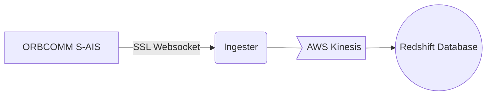

# OrbcommIngester



## Running Locally

🚨 **We only pay for 1 Orbcomm Stream reader, so if you run locally it cuts off our main reader in AWS.** 🚨

If your local stream is getting no messages then it is likely another service is connected to the stream.

### Via Docker [RECOMMENDED]

ℹ️ Make sure to have docker installed and setup locally first! [Instructions](https://www.docker.com/get-started/)

```sh
docker build -t spotship/orbcomm-ingester:latest .
docker run spotship/orbcomm-ingester:latest
```

### Via Pipenv

```sh
pipenv install
pipenv run python app.py
```

## CICD

Uses Github actions to push to ECR and deploy the service on AWS Fargate. The workflow is in `.github/workflows/aws.yml`

This is started automatically on a successful pr merge into `main` branch.

_N.B._ can be started manually in the github actions console by clicking run workflow and choosing the branch to use.

You can edit the task definition to edit the service configuration in `taskdef.json`.

[Instructions used to setup](https://www.awstutorials.cloud/post/tutorials/ecs-deploy-github-actions/).

Uses `Github` IAM user credentials in repo secret & `orbcomm-ingester`ECR repo.

---

## AIS Message types

### Useful links

- [What is AIS?](https://www.marineinsight.com/marine-navigation/automatic-identification-system-ais-integrating-and-identifying-marine-communication-channels/)
- [Message types](https://arundaleais.github.io/docs/ais/ais_message_types.html)

### Type 1

#### Example

```json

```

### Type 2

#### Example

```json

```

### Type 3

#### Example

```json
{'msg_type': 3, 'repeat': 0, 'mmsi': 272700000, 'status': <NavigationStatus.Moored: 5>, 'turn': 0.0, 'speed': 0.0, 'accuracy': True, 'lon': 31.021412, 'lat': 46.602015, 'course': 302.6, 'heading': 68, 'second': 56, 'maneuver': 3, 'spare_1': b'\xc0', 'raim': True, 'radio': 58380}
```

### Type 4

#### Example

```json

```

### Type 5

#### Example

```json

```

### Type 18

#### Example

```json
{
    'msg_type': 18,
    'repeat': 0,
    'mmsi': 316044687,
    'reserved_1': 0,
    'speed': 0.0,
    'accuracy': True,
    'lon': -122.499012,
    'lat': 37.972215,
    'course': 283.9,
    'heading': 511,
    'second': 20,
    'reserved_2': 0,
    'cs': True,
    'display': False,
    'dsc': True,
    'band': True,
    'msg22': False,
    'assigned': False,
    'raim': True,
    'radio': 917510
}
```

---

Markdown linting is enabled by an extension in vscode [markdownlint](https://marketplace.visualstudio.com/items?itemName=DavidAnson.vscode-markdownlint)

These rules can be configured using `.markdownlint.json`

- [Markdown Cheat Sheet](https://github.com/adam-p/markdown-here/wiki/Markdown-Cheatsheet)
- [Markdown Emoji Cheatsheet](https://gist.github.com/rxaviers/7360908)
- [Markdown CodeBlock Language List](https://github.com/github/linguist/blob/master/lib/linguist/languages.yml)
- [Mermaid Diagram Visual Editor](https://mermaid.live)
- [Mermaid CheatSheet](https://jojozhuang.github.io/tutorial/mermaid-cheat-sheet/)
