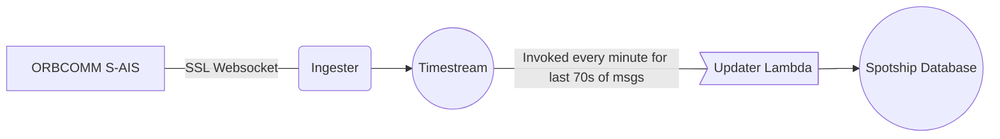

# OrbcommIngester



## Running Locally

🚨 **We only pay for 1 Orbcomm Stream reader, so if you run locally it cuts off our main reader in AWS.** 🚨

If your local stream is getting no messages then it is likely another service is connected to the stream.

### Via Docker [RECOMMENDED]

ℹ️ Make sure to have docker installed and setup locally first! [Instructions](https://www.docker.com/get-started/)

```sh
docker build -t spotship/orbcomm-ingester:latest .
docker run spotship/orbcomm-ingester:latest
```

### Via Pipenv

```sh
pipenv install
pipenv run python app.py
```

## CICD

Uses Github actions to push to ECR and deploy the service on AWS Fargate. The workflow is in `.github/workflows/aws.yml`

This is started automatically on a successful pr merge into `main` branch.

_N.B._ can be started manually in the github actions console by clicking run workflow and choosing the branch to use.

You can edit the task definition to edit the service configuration in `taskdef.json`.

[Instructions used to setup](https://www.awstutorials.cloud/post/tutorials/ecs-deploy-github-actions/).

Uses `Github` IAM user credentials in repo secret & `orbcomm-ingester`ECR repo.

---

## AIS Message types

A number of messages we get through are marked as not supported below as we do not care about their contents at this time.

### Useful links

- [What is AIS?](https://www.marineinsight.com/marine-navigation/automatic-identification-system-ais-integrating-and-identifying-marine-communication-channels/)
- [Message types](https://arundaleais.github.io/docs/ais/ais_message_types.html)
- [Timestream Write](https://boto3.amazonaws.com/v1/documentation/api/latest/reference/services/timestream-write.html)
- [AIS MSG Decoder](https://www.maritec.co.za/aisvdmvdodecoding)

### Raw message examples

Msgs can be single or multipart.

_N.B._ Msgs that have AIVDM are for other vessels, AIVDO are your own vessels, we only care about AIVDM as we don't have vessels.

```txt
!AIVDM,1,1,,A,13u?etPv2;0n:dDPwUM1U1Cb069D,0*23
!AIVDM,1,1,,A,400TcdiuiT7VDR>3nIfr6>i00000,0*78
!AIVDM,2,1,0,A,58wt8Ui`g??r21`7S=:22058<v05Htp000000015>8OA;0sk,0*7B
!AIVDM,2,2,0,A,eQ8823mDm3kP00000000000,2*5D
!AIVDM,1,1,4,B,6>jR0600V:C0>da4P106P00,2*02
!AIVDM,2,1,9,B,61c2;qLPH1m@wsm6ARhp<ji6ATHd<C8f=Bhk>34k;S8i=3To,0*2C
!AIVDM,2,2,9,B,Djhi=3Di<2pp=34k>4D,2*03
!AIVDM,1,1,1,B,8>h8nkP0Glr=<hFI0D6??wvlFR06EuOwgwl?wnSwe7wvlOw?sAwwnSGmwvh0,0*17
!AIVDO,1,1,,A,95M2oQ@41Tr4L4H@eRvQ;2h20000,0*0D
!AIVDM,1,1,,B,;8u:8CAuiT7Bm2CIM=fsDJ100000,0*51
!AIVDM,1,1,,B,>>M4fWA<59B1@E=@,0*17
!AIVDM,1,1,,A,B6CdCm0t3`tba35f@V9faHi7kP06,0*58
!AIVDM,2,1,0,B,C8u:8C@t7@TnGCKfm6Po`e6N`:Va0L2J;06HV50JV?SjBPL3,0*28
!AIVDM,2,2,0,B,11RP,0*17
!AIVDO,2,1,5,B,E1c2;q@b44ah4ah0h:2ab@70VRpU<Bgpm4:gP50HH`Th`QF5,0*7B
!AIVDO,2,2,5,B,1CQ1A83PCAH0,0*60
!AIVDO,1,1,,B,H1c2;qA@PU>0U>060<h5=>0:1Dp,2*7D
!AIVDO,1,1,,B,H1c2;qDTijklmno31<<C970`43<1,0*28
!AIVDM,1,1,,A,KCQ9r=hrFUnH7P00,0*41
!AIVDM,1,1,,B,KC5E2b@U19PFdLbMuc5=ROv62<7m,0*16
!AIVDM,1,1,,B,K5DfMB9FLsM?P00d,0*70
```

### Type 1

_Position report_ | Scheduled position report (Class A shipborne mobile equipment).

#### Example

```json
{
  "type": 1,
  "repeat": 0,
  "mmsi": "657177000",
  "status": 8,
  "turn": 0,
  "speed": 0.8,
  "accuracy": 1,
  "lon": 7.824271666666666,
  "lat": 4.016156666666666,
  "course": 205.8,
  "heading": 225,
  "second": 14,
  "maneuver": 0,
  "raim": 0,
  "radio": 24812
}
```

### Type 2

_Position report_ | Assigned scheduled position report (Class A shipborne mobile equipment).

#### Example

```json
{
  "type": 1,
  "repeat": 0,
  "mmsi": "657177000",
  "status": 8,
  "turn": 0,
  "speed": 0.8,
  "accuracy": 1,
  "lon": 7.824271666666666,
  "lat": 4.016156666666666,
  "course": 205.8,
  "heading": 225,
  "second": 14,
  "maneuver": 0,
  "raim": 0,
  "radio": 24812
}
```

### Type 3

_Position report_ | Special position report, response to interrogation (Class A shipborne mobile equipment).

#### Example

```json
{
    "msg_type": 3,
    "repeat": 0,
    "mmsi": 272700000,
    "status": 5,
    "turn": 0.0,
    "speed": 0.0,
    "accuracy": True,
    "lon": 31.021412,
    "lat": 46.602015,
    "course": 302.6,
    "heading": 68,
    "second": 56,
    "maneuver": 3,
    "spare_1": b"\xc0",
    "raim": True,
    "radio": 58380
}
```

### Type 4

_Base station report_ | Position, UTC, date and current slot number of base station.

#### Example

```json
{
    "type": 4,
    "repeat": 0,
    "mmsi": "006631000",
    "year": 0,
    "month": 0,
    "day": 0,
    "hour": 24,
    "minute": 60,
    "second": 60,
    "accuracy": 0,
    "lon": 181.0,
    "lat": 91.0,
    "epfd": <EpfdType.Undefined: 0>,
    "raim": 0,
    "radio": 147456
}
```

### Type 5

_Static and voyage related data_ | Scheduled static and voyage related vessel data report (Class A shipborne mobile equipment).

#### Example

```json
{
    "msg_type": 5,
    "repeat": 0,
    "mmsi": 413236380,
    "ais_version": 0,
    "imo": 0,
    "callsign": "0",
    "shipname": "FENG CHUAN 68",
    "ship_type": 70,
    "to_bow": 45,
    "to_stern": 12,
    "to_port": 6,
    "to_starboard": 4,
    "epfd": 0,
    "month": 12,
    "day": 4,
    "hour": 9,
    "minute": 0,
    "draught": 1.9,
    "destination": "FUZHOU",
    "dte": True
}
```

### Type 6 (Not Supported)

_Binary addressed message_ | Binary data for addressed communication.

#### Example

```json
{
  "type": 6,
  "repeat": 0,
  "mmsi": "997011052",
  "seqno": 0,
  "dest_mmsi": "000000000",
  "retransmit": 0,
  "dac": 235,
  "fid": 10,
  "data": "00111111110000000000000010000000000000000000000000"
}
```

### Type 7 (Not Supported)

_Binary acknowledgement_ | Acknowledgement of received addressed binary data.

#### Example

```json
{
  "type": 7,
  "repeat": 0,
  "mmsi": "803866656",
  "mmsi1": "034078723",
  "mmsiseq1": 0,
  "mmsi2": "000000000",
  "mmsiseq2": 0,
  "mmsi3": "000000000",
  "mmsiseq3": 0,
  "mmsi4": "000000000",
  "mmsiseq4": 0
}
```

### Type 8 (Not Supported)

_Binary broadcast message_ | Binary data for broadcast communication.

#### Example

```json
{
  "type": 8,
  "repeat": 0,
  "mmsi": "545392672",
  "dac": 32,
  "fid": 32,
  "data": "1000000000"
}
```

### Type 9 (Not Supported)

_Standard SAR aircraft position report_ | Position report for airborne stations involved in SAR operations, only.

#### Example

```json
{
  "type": 9,
  "repeat": 0,
  "mmsi": "111277501",
  "alt": 166,
  "speed": 85,
  "accuracy": 1,
  "lon": 21.527515,
  "lat": 55.86421833333333,
  "course": 16.5,
  "second": 63,
  "dte": 1,
  "assigned": 0,
  "raim": 0,
  "radio": 99126
}
```

### Type 10 (Not Supported)

_UTC/date inquiry_ | Request UTC and date.

#### Example

```json
{
  "type": 10,
  "repeat": 0,
  "mmsi": "332044320",
  "dest_mmsi": "034086918"
}
```

### Type 11 (Not Supported)

_UTC/date response_ | Current UTC and date if available.

#### Example

```json
{
    "type": 11,
    "repeat": 0,
    "mmsi": "366916740",
    "year": 2021,
    "month": 5,
    "day": 5,
    "hour": 16,
    "minute": 8,
    "second": 4,
    "accuracy": 0,
    "lon": -166.21348166666667,
    "lat": 54.15264333333333,
    "epfd": <EpfdType.GPS: 1>,
    "raim": 0,
    "radio": 0
}
```

### Type 12 (Not Supported)

_Addressed safety related message_ | Safety related data for addressed communication.

#### Example

```json
{
  "type": 12,
  "repeat": 0,
  "mmsi": "004310704",
  "seqno": 2,
  "dest_mmsi": "441158000",
  "retransmit": 0,
  "text": "<WARNING> YOU ARE GOING TO AGROUND. PLEASE CHECK"
}
```

### Type 13 (Not Supported)

_Safety related acknowledge-ment_ | Acknowledgement of received addressed safety related message.

#### Example

```json
{
  "type": 13,
  "repeat": 3,
  "mmsi": "092340564",
  "mmsi1": "150077699",
  "mmsiseq1": 0,
  "mmsi2": "000000000",
  "mmsiseq2": 0,
  "mmsi3": "000000000",
  "mmsiseq3": 0,
  "mmsi4": "000000000",
  "mmsiseq4": 0
}
```

### Type 14 (Not Supported)

_Safety related broadcast message_ | Safety related data for broadcast communication.

#### Example

```json
{
  "type": 14,
  "repeat": 0,
  "mmsi": "503316566",
  "text": "LPE"
}
```

### Type 15 (Not Supported)

_Interrogation_ | Request for a specific message type (can result in multiple responses from one or several stations).

#### Example

```json
{
  "type": 15,
  "repeat": 0,
  "mmsi": "000000000",
  "mmsi1": "000000008",
  "type1_1": 0,
  "offset1_1": 0,
  "type1_2": 0,
  "offset1_2": 0,
  "mmsi2": "000000000",
  "type2_1": 0,
  "offset2_1": 0
}
```

### Type 16 (Not Supported)

_Assignment mode command_ | Assignment of a specific report behaviour by competent authority using a Base station.

#### Example

```json
{
  "type": 16,
  "repeat": 1,
  "mmsi": "431804640",
  "mmsi1": "021504015",
  "offset1": 0,
  "increment1": 0,
  "mmsi2": "000000000",
  "offset2": 0,
  "increment2": 0
}
```

### Type 17 (Not Supported)

_DGNSS broadcast binary message_| DGNSS corrections provided by a base station.

#### Example

```json
{
  "type": 17,
  "repeat": 0,
  "mmsi": "545392672",
  "lon": 8322,
  "lat": 0,
  "data": 0
}
```

### Type 18

_Standard Class B equipment position report_ | Standard position report for Class B shipborne mobile equipment to be used instead of Messages 1, 2, 3.

#### Example

```json
{
    "msg_type": 18,
    "repeat": 0,
    "mmsi": 316044687,
    "reserved_1": 0,
    "speed": 0.0,
    "accuracy": True,
    "lon": -122.499012,
    "lat": 37.972215,
    "course": 283.9,
    "heading": 511,
    "second": 20,
    "reserved_2": 0,
    "cs": True,
    "display": False,
    "dsc": True,
    "band": True,
    "msg22": False,
    "assigned": False,
    "raim": True,
    "radio": 917510
}
```

### Type 19 (Not Supported)

_Extended Class B equipment position report_ | **[No longer required]** Extended position report for Class B shipborne mobile equipment, contains additional static information.

#### Example

```json
{
    "type": 19,
    "repeat": 0,
    "mmsi": "413848311",
    "speed": 0.1,
    "accuracy": 0,
    "lon": 120.20996166666667,
    "lat": 31.94901,
    "course": 68.4,
    "heading": 511,
    "second": 60,
    "regional": 0,
    "shipname": "JINWANG558",
    "shiptype": <ShipType.Cargo: 70>,
    "to_bow": 5,
    "to_stern": 57,
    "to_port": 5,
    "to_starboard": 7,
    "epfd": <EpfdType.Undefined: 0>,
    "raim": 0,
    "dte": 1,
    "assigned": 0
}
```

### Type 20 (Not Supported)

_Data link management message_ | Reserve slots for Base station(s)

#### Example

```json
{
  "type": 20,
  "repeat": 0,
  "mmsi": "545392672",
  "offset1": 130,
  "number1": 0,
  "timeout1": 4,
  "increment1": 0,
  "offset2": 0,
  "number2": 0,
  "timeout2": 0,
  "increment2": 0,
  "offset3": 0,
  "number3": 0,
  "timeout3": 0,
  "increment3": 0,
  "offset4": 0,
  "number4": 0,
  "timeout4": 0,
  "increment4": 0
}
```

### Type 21 (Not Supported)

_Aids-to-navigation report_ | Position and status report for aids-to-navigation.

#### Example

```json
{
    "type": 21,
    "repeat": 0,
    "mmsi": "992471026",
    "aid_type": <NavAid.SPARE: 5>,
    "name": "E1438 MONTE PORO",
    "accuracy": 0,
    "lon": 10.237318333333333,
    "lat": 42.727788333333336,
    "to_bow": 1,
    "to_stern": 1,
    "to_port": 1,
    "to_starboard": 1,
    "epfd": <EpfdType.Undefined: 0>,
    "second": 60,
    "off_position": 0,
    "regional": 0,
    "raim": 0,
    "virtual_aid": 0,
    "assigned": 0,
    "name_extension": ""
}
```

### Type 22 (Not Supported)

_Channel management_ | Management of channels and transceiver modes by a Base station.

#### Example

```json

```

### Type 23 (Not Supported)

_Group assignment command_ | Assignment of a specific report behaviour by competent authority using a Base station to a specific group of mobiles.

#### Example

```json
{
    "type": 23,
    "repeat": 0,
    "mmsi": "1048707072",
    "ne_lon": 0.0,
    "ne_lat": 0.0,
    "sw_lon": 0.0,
    "sw_lat": 0.0,
    "station_type": <StationType.ALL: 0>,
    "ship_type": <ShipType.NotAvailable: 0>,
    "txrx": <TransmitMode.TXA_TXB_RXA_RXB: 0>,
    "interval": <StationIntervals.AUTONOMOUS_MODE: 0>,
    "quiet": 0
}
```

### Type 24 (Not Supported)

_Static data report_ | Additional data assigned to an MMSI, _Part A_: Name, _Part B_: Static Data.

#### Example

```json
{
  "type": 24,
  "mmsi": "512039000",
  "shipname": "RV POLARIS II"
}
```

### Type 25 (Not Supported)

_Single slot binary message_ | Short unscheduled binary data transmission (Broadcast or addressed).

#### Example

```json
{
  "type": 25,
  "repeat": 0,
  "mmsi": "025165824",
  "addressed": 0,
  "structured": 0,
  "data": ""
}
```

### Type 26 (Not Supported)

_Multiple slot binary message with Communications State_ | Scheduled binary data transmission (Broadcast or addressed).

#### Example

```json
{
  "type": 26,
  "repeat": 0,
  "mmsi": "367597230",
  "addressed": 0,
  "structured": 1,
  "radio": 584224,
  "app_id": 5768,
  "data": "11000011001010011000011111101111011010100111100100010110011001001100111111100011110101000010111100011101000101011100001000"
}
```

### Type 27 (Not Supported)

_Position report for long-range applications_ | Class A and Class B “SO” shipborne mobile equipment outside base station coverage.

#### Example

```json
{
    "type": 27,
    "repeat": 0,
    "mmsi": "232021787",
    "accuracy": 1,
    "raim": 1,
    "status": <NavigationStatus.Undefined: 15>,
    "lon": -61.85,
    "lat": 17.118333333333332,
    "speed": 0,
    "course": 511,
    "gnss": 0
}
```

---

Markdown linting is enabled by an extension in vscode [markdownlint](https://marketplace.visualstudio.com/items?itemName=DavidAnson.vscode-markdownlint)

These rules can be configured using `.markdownlint.json`

- [Markdown Cheat Sheet](https://github.com/adam-p/markdown-here/wiki/Markdown-Cheatsheet)
- [Markdown Emoji Cheatsheet](https://gist.github.com/rxaviers/7360908)
- [Markdown CodeBlock Language List](https://github.com/github/linguist/blob/master/lib/linguist/languages.yml)
- [Mermaid Diagram Visual Editor](https://mermaid.live)
- [Mermaid CheatSheet](https://jojozhuang.github.io/tutorial/mermaid-cheat-sheet/)
